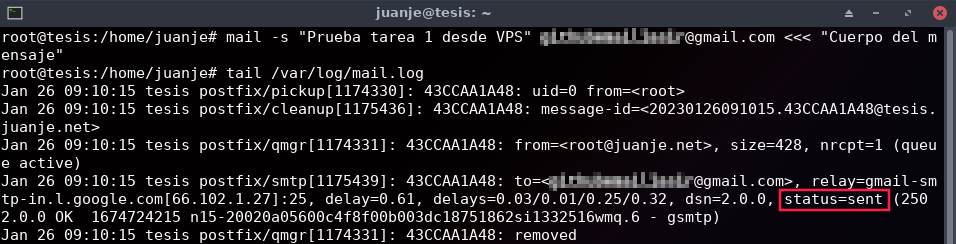
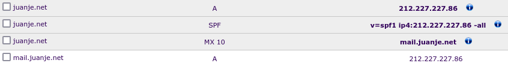

# **Práctica: Servidor de correos**

**Tabla de contenidos:**

- [**Práctica: Servidor de correos**](#práctica-servidor-de-correos)
  - [**Disclaimer**](#disclaimer)
  - [**¿Qué hay que hacer?**](#qué-hay-que-hacer)
  - [**Gestión de correos desde el servidor**](#gestión-de-correos-desde-el-servidor)
  - [**Uso de alias y redirecciones**](#uso-de-alias-y-redirecciones)
  - [**Para asegurar el envío**](#para-asegurar-el-envío)
  - [**Para luchar contra el SPAM**](#para-luchar-contra-el-spam)
  - [**Gestión de correos desde un cliente**](#gestión-de-correos-desde-un-cliente)
  - [**Comprobación final**](#comprobación-final)
  - [**Realización**](#realización)
    - [**Tarea 1**](#tarea-1)
    - [**Tarea 2**](#tarea-2)
    - [**Tarea 3**](#tarea-3)
    - [**Tarea 4 (No obligatoria)**](#tarea-4-no-obligatoria)
    - [**Tarea 5 (No obligatoria)**](#tarea-5-no-obligatoria)
    - [**Tarea 6 (No obligatoria)**](#tarea-6-no-obligatoria)
    - [**Tarea 7 (No obligatoria)**](#tarea-7-no-obligatoria)
    - [**Tarea 8 (No obligatoria)**](#tarea-8-no-obligatoria)
    - [**Tarea 9 (No obligatoria)**](#tarea-9-no-obligatoria)
    - [**Tarea 11**](#tarea-11)
    - [**Tarea 10 (No obligatoria)**](#tarea-10-no-obligatoria)
    - [**Tarea 12 (No obligatoria)**](#tarea-12-no-obligatoria)
    - [**Tarea 13**](#tarea-13)

## **Disclaimer**

Este archivo ha sido generado a partir de mis propios apuntes en markdown y puede que el color de letra con el que se muestre sea diferente o, que existan cortes en los bloques de código entre páginas. Estos errores no existen en el documento original. Si desea consultar el documento original en markdown estaré encantado de adjuntarlo.

---

Link: [https://fp.josedomingo.org/sri2223/6_correo/practica.html](https://fp.josedomingo.org/sri2223/6_correo/practica.html)

---

## **¿Qué hay que hacer?**

Instala y configura de manera adecuada el servidor de correos en tu VPS. El nombre del servidor de correo será `mail.tudominio.es` (este es el nombre que deberá aparecer en el registro MX).

---

## **Gestión de correos desde el servidor**

El envío y recepción se hará desde el servidor usando la herramienta `mail`.

- **Tarea 1**: Documenta una prueba de funcionamiento, donde envíes desde tu servidor local al exterior. Muestra el log donde se vea el envío. Muestra el correo que has recibido. Muestra el registro SPF.
- **Tarea 2**: Documenta una prueba de funcionamiento, donde envíes un correo desde el exterior (gmail, hotmail,...) a tu servidor local. Muestra el log donde se vea el envío. Muestra cómo has leído el correo. Muestra el registro MX de tu dominio.

---

## **Uso de alias y redirecciones**

- **Tarea 3**: Uso de alias y redirecciones.

Vamos a comprobar como los procesos del servidor pueden mandar correos para informar sobre su estado. Por ejemplo cada vez que se ejecuta una tarea cron podemos enviar un correo informando del resultado. Normalmente estos correos se mandan al usuario `root` del servidor, para ello:

    $ crontab -e

E indico donde se envía el correo:

    MAILTO = root

Puedes poner alguna tarea en el cron para ver como se mandan correo.

Posteriormente usando alias y redirecciones podemos hacer llegar esos correos a nuestro correo personal.

Configura el `cron` para enviar correo al usuario `root`. Comprueba que están llegando esos correos al `root`. Crea un nuevo alias para que se manden a un usuario sin privilegios. Comprueban que llegan a ese usuario. Por último crea una redirección para enviar esos correo a tu correo personal (gmail,hotmail,...).

---

## **Para asegurar el envío**

- **Tarea 4 (No obligatoria)**: Configura de manera adecuada DKIM es tu sistema de correos. Comprueba el registro DKIM en la página https://mxtoolbox.com/dkim.aspx. Configura postfix para que firme los correos que envía. Manda un correo y comprueba la verificación de las firmas en ellos.

---

## **Para luchar contra el SPAM**

- **Tarea 5 (No obligatorio)**: Configura de manera adecuada Postfix para que tenga en cuenta el registro SPF de los correos que recibe. Muestra el log del correo para comprobar que se está haciendo el testeo del registro SPF.

- **Tarea 6 (No obligatoria)**: Configura un sistema antispam. Realiza comprobaciones para comprobarlo.

- **Tarea 7 (No obligatoria)**: Configura un sistema antivirus. Realiza comprobaciones para comprobarlo. 

---

## **Gestión de correos desde un cliente**

- **Tarea 8**: Configura el buzón de los usuarios de tipo `Maildir`. Envía un correo a tu usuario y comprueba que el correo se ha guardado en el buzón `Maildir` del usuario del sistema correspondiente. Recuerda que ese tipo de buzón no se puede leer con la utilidad `mail`.

- **Tarea 9**: Instala configura dovecot para ofrecer el protocolo IMAP. Configura dovecot de manera adecuada para ofrecer autentificación y cifrado.

    Para realizar el cifrado de la comunicación crea un certificado en LetsEncrypt para el dominio `mail.tudominio.es`. Recuerda que para el ofrecer el cifrado tiene varias soluciones:

    - **IMAP con STARTTLS**: STARTTLS transforma una conexión insegura en una segura mediante el uso de SSL/TLS. Por lo tanto usando el mismo puerto 143/tcp tenemos cifrada la comunicación.
    - **IMAPS**: Versión segura del protocolo IMAP que usa el puerto 993/tcp.
    - Ofrecer las dos posibilidades.

    Elige una de las opciones anterior para realizar el cifrado. Y muestra la configuración de un cliente de correo (evolution, thunderbird, ...) y muestra como puedes leer los correos enviado a tu usuario.

- **Tarea 10 (No obligatoria)**: Instala un webmail (roundcube, horde, rainloop) para gestionar el correo del equipo mediante una interfaz web. Muestra la configuración necesaria y cómo eres capaz de leer los correos que recibe tu usuario.

- **Tarea 11**: Configura de manera adecuada postfix para que podamos mandar un correo desde un cliente remoto. La conexión entre cliente y servidor debe estar autentificada con SASL usando dovecot y además debe estar cifrada. Para cifrar esta comunicación puedes usar dos opciones:

    - **ESMTP + STARTTLS**: Usando el puerto 567/tcp enviamos de forma segura el correo al servidor.
    - **SMTPS**: Utiliza un puerto no estándar  (465) para SMTPS (Simple Mail Transfer Protocol Secure). No es una extensión de smtp. Es muy parecido a HTTPS.

    Elige una de las opciones anterior para realizar el cifrado. Y muestra la configuración de un cliente de correo (evolution, thunderbird, ...) y muestra como puedes enviar los correos.

- **Tarea 12 (No obligatoria)**: Configura el cliente webmail para el envío de correo. Realiza una prueba de envío con el webmail.

---

## **Comprobación final**

- **Tarea 13**: Prueba de envío de correo. En esta [página](https://www.mail-tester.com/) tenemos una herramienta completa y fácil de usar a la que podemos enviar un correo para que verifique y puntúe el correo que enviamos. Captura la pantalla y muestra la puntuación que has sacado.

---

## **Realización**

### **Tarea 1**

En este apartado, local hace referencia al servidor de mi VPS. Sabiendo esto, comienzo.

Primero voy al registro DNS de mi dominio y añado un registro A con los siguientes valores:


También agrego un registro SPF:

```spf
v=spf1 ip4:212.227.227.86 -all
```


Tras esto, abro el puerto 25 en el firewall de mi VPS:


Y ahora, configuro el registro PTR (DNS inversa) con el fqdn de mi VPS:


Hecho esto, me conecto al VPS e instalo y configuro todo:

```bash
ssh -AJ gonzalo@puente juanje@tesis.juanje.net # Desde la red del instituto

su -

apt update

apt install postfix bsd-mailx -y
```

*Internet Site --> juanje.net*

Envío el email a mi correo personal:

```bash
mail -s "Prueba tarea 1 desde VPS" email@gmail.com
# Enter + Cuerpo del mensaje + Ctrl D + Enter
# O alternativamente: mail -s "Prueba tarea 1 desde VPS" email@gmail.com <<< "Cuerpo del mensaje"
```

Log del envío en mi VPS:

```bash
tail /var/log/mail.log
```



Y veo que ha llegado correctamente:


---

### **Tarea 2**

Ahora, tengo que enviar un email desde el exterior y que llegue a mi VPS. Para ello, voy a usar el servicio de correo de Gmail.

Pero antes, creo un nuevo registro MX 10 en mi DNS:



Envío un email desde mi cuenta de Gmail:


Y veo que ha llegado correctamente, puedo comprobarlo con:

```bash
mail
```


---

### **Tarea 3**

En este apartado configuraré una tarea mediante [cron](https://crontab.guru/) para que envíe un email al usuario *root* cada minuto. Después, crearé un alias para que los emails se manden a mi usuario *juanje*. Finalmente, crearé una redirección para que los emails se envíen a mi correo personal de Gmail.

Primero, creo un script sencillo que mostrará la fecha y hora actual, además de la salida de los comandos *uptime* y *lsblk -f*:


```bash
su -

nano -cl /root/script-correo.sh
```

```bash
#!/bin/bash

echo "Fecha y hora: $(date)"
echo "========================================="
echo "Uptime: $(uptime)"
echo "========================================="
echo "Dispositivos montados:"
lsblk -f
```

Compruebo que funciona correctamente:

```bash
chmod +x /root/script-correo.sh

bash /root/script-correo.sh
```


Hecho esto, creo la tarea en cron:

```bash
crontab -e
```

Agrego las siguientes líneas:

```bash
MAILTO = root

* * * * * /root/script-correo.sh
```


Hecho esto, guardo el fichero y espero a que se ejecute la tarea. Pasado el tiempo que he indicado, recibo el email:


El siguiente paso será crear un alias para que los emails se manden a mi usuario *juanje*:

```bash
nano -cl /etc/aliases
```

Agrego la siguiente línea:

```bash
root:    juanje
```


Guardo el fichero y ejecuto el comando encargado de actualizar los alias:

```bash
newaliases
```

Si ahora miro el email de mi usuario *juanje*, veré que los emails de *root* se han reenviado correctamente:


Por último, creo una redirección para que los emails se envíen a mi correo personal de Gmail:

```bash
nano -cl /home/juanje/.forward
```

Agrego mi dirección de correo:

```bash
email@gmail.com
```

Tras guardar el fichero, si miro mi correo de Gmail, veré que los emails se han reenviado correctamente:


---

### **Tarea 4 (No obligatoria)**

En este apartado configuraré el DKIM (*DomainKeys Identified Mail*) para que los emails que envíe mi VPS sean firmados digitalmente. Para ello, primero instalaré los paquetes necesarios:

```bash
apt install opendkim opendkim-tools -y
```

A continuación, edito el fichero de configuración del servicio:

```bash
nano -cl /etc/opendkim.conf
```

Edito las siguientes líneas:

```bash
Domain                  juanje.net
Selector                dkim2023
KeyFile                 /etc/dkimkeys/dkim2023.private
#Socket                 local:/run/opendkim/opendkim.sock
Socket                  inet:8891@localhost
PidFile                 /run/opendkim/opendkim.pid
TrustAnchorFile         /usr/share/dns/root.key
```

Tras modificar el socket, edito el fichero */etc/default/opendkim*:

```bash
nano -cl /etc/default/opendkim
```

Edito la línea *SOCKET*:

```bash
SOCKET=inet:8891@localhost
```

Modifico el fichero */etc/postfix/main.cf* para indicar el mecanismo de firma de mensajes:

```bash
nano -cl /etc/postfix/main.cf
```

Agrego las siguientes líneas:

```bash
milter_default_action = accept
milter_protocol = 6
smtpd_milters = inet:localhost:8891
non_smtpd_milters = $smtpd_milters
```

Con todo esto configurado, genero el par de claves que usaré para firmar los emails y le doy permisos al usuario *opendkim* para acceder a ellas:

```bash
cd /etc/dkimkeys

opendkim-genkey -s dkim2023 -d juanje.net -b 2048

chown opendkim:opendkim dkim2023.private dkim2023.txt
```


Ahora, el contenido del fichero *dkim2023.txt* no será simplemente la clave, sino que el formato es un poco más complejo. Para que Postfix pueda usarla, tengo que modificarla, este es el contenido actual:

```txt
dkim2023._domainkey	IN	TXT	( "v=DKIM1; h=sha256; k=rsa; "
	  "p=MIIBIjANBgkqhkiG9w0BAQEFAAOCAQ8AMIIBCgKCAQEArt81o+j9F0C2Xwsyr0XfYogqIk+ZbpHgMzuu8QGSER9vPp0U3vDVF2Uqev1z2T0ohduE93X9MOoo0j6gIZWtF2se/I4frrzk9RPnp1vn4HXHgpzYHb5TT+/j0LincSs5UznuTcB9+CST0QCYP4LR6hDDIgH7JZ3kuKTFQi+5EfHrl4RPDNRuZSN1soAyaEr7tWuCnfJ5miYVVw"
	  "5ZtBY74oMpjAxI8QsfhLYpWNBUUUHIJmq7+dbTYkrG02z8xzM8tlgA/bM4oVQXCKKizU7DRu+AjcRuZ+Wy+TEyyYzksPph0UUMpWXKELNF7u/AkEcoBU+X/kWdkUZbsZtkFgdwMQIDAQAB" )  ; ----- DKIM key dkim2023 for juanje.net
```

En el registro TXT del DNS colocaré lo siguiente, extraído del texto anterior:

```txt
v=DKIM1; h=sha256; k=rsa; p=MIIBIjANBgkqhkiG9w0BAQEFAAOCAQ8AMIIBCgKCAQEArt81o+j9F0C2Xwsyr0XfYogqIk+ZbpHgMzuu8QGSER9vPp0U3vDVF2Uqev1z2T0ohduE93X9MOoo0j6gIZWtF2se/I4frrzk9RPnp1vn4HXHgpzYHb5TT+/j0LincSs5UznuTcB9+CST0QCYP4LR6hDDIgH7JZ3kuKTFQi+5EfHrl4RPDNRuZSN1soAyaEr7tWuCnfJ5miYVVw5ZtBY74oMpjAxI8QsfhLYpWNBUUUHIJmq7+dbTYkrG02z8xzM8tlgA/bM4oVQXCKKizU7DRu+AjcRuZ+Wy+TEyyYzksPph0UUMpWXKELNF7u/AkEcoBU+X/kWdkUZbsZtkFgdwMQIDAQAB
```

Quedando así:


Reiniciamos los servicios para que se apliquen los cambios:

```bash
systemctl restart opendkim postfix
```

Podemos comprobar que opendkim está escuchando en el puerto 8891:

```bash
netstat -tulpn | grep 8891
```


Efectivamente, está escuchando en el puerto 8891. Ahora, para comprobar que funciona correctamente, envío un email a mi cuenta de Gmail y compruebo que el mensaje está firmado viendo el mensaje original en el menú desplegable que ofrece la web de Gmail:


Si voy a la [web indicada en el enunciado](https://mxtoolbox.com/dkim.aspx), y compruebo el registro DKIM, me indica que está correctamente configurado:


---

### **Tarea 5 (No obligatoria)**

Para que postfix tenga en cuenta el registro SPF de los correos que recibe, debemos instalar el paquete *postfix-policyd-spf-python*:

```bash
apt install postfix-policyd-spf-python -y
```

Una vez instalado, editamos el fichero */etc/postfix/master.cf* y agregamos las siguientes líneas:

```bash
nano -cl /etc/postfix/master.cf
```

```bash
policy-spf  unix  -       n       n       -       0       spawn
  user=policyd-spf argv=/usr/bin/policyd-spf
```


Con esto le indicamos a postfix que debe ejecutar el servicio *policyd-spf* para comprobar el registro SPF de los correos que recibe. Ahora, debemos editar el fichero */etc/postfix/main.cf* y agregar las siguientes líneas:

```bash
nano -cl /etc/postfix/main.cf
```

```bash
policy-spf_time_limit = 3600
smtpd_recipient_restrictions = check_policy_service unix:private/policy-spf
```


Con esto, le indicamos a postfix que cualquier correo recibido que no pase el filtro SPF, será rechazado. Ahora, reinicio el servicio postfix:

```bash
systemctl restart postfix
```

Y compruebo que los correos que llegan ahora, pasan por la comprobación SPF. Esto lo hago enviando un mail de mi cuenta de Gmail a mi cuenta de correo de mi servidor, y comprobando el log de postfix:

```bash
tail -f /var/log/mail.log
```


Podemos ver que funciona correctamente, ya que el correo que he enviado desde mi cuenta de Gmail, ha pasado por el filtro SPF y ha sido aceptado.

---

### **Tarea 6 (No obligatoria)**

Para proteger nuestra bandeja de correo de mensajes SPAM, usaremos un servicio de filtrado de correo llamado *SpamAssassin*. Lo instalamos y habilitamos el servicio:

```bash
apt install spamassassin spamc -y

systemctl enable --now spamassassin
```

Ahora, debemos editar el fichero */etc/default/spamassassin* y agregar las siguientes líneas para que se actualice la base de datos de SpamAssassin cada 24 horas:

```bash
nano -cl /etc/default/spamassassin
```

```bash
CRON=1
```


Ahora, debemos editar el fichero */etc/postfix/master.cf* y agregar las siguientes líneas para que postfix use SpamAssassin para filtrar los correos que recibe:

```bash
nano -cl /etc/postfix/master.cf
```

```bash
smtp      inet  n       -       y       -       -       smtpd
  -o content_filter=spamassassin
submission inet n       -       y       -       -       smtpd
  -o content_filter=spamassassin
spamassassin unix -     n       n       -       -       pipe
  user=debian-spamd argv=/usr/bin/spamc -f -e /usr/sbin/sendmail -oi -f ${sender} ${recipient}
```


Para finalizar, configuro que los emails detectados como SPAM reciban en su asunto el texto **SPAM**:

```bash
nano -cl /etc/spamassassin/local.cf
```

Descomento la línea que contiene la directiva *rewrite_header*:

```bash
rewrite_header Subject *****SPAM*****
```


Reinicio los servicios para que se apliquen los cambios:

```bash
systemctl restart spamassassin postfix
```

Para comprobar que funciona correctamente, envío un email a mi cuenta de correo en mi VPS desde mi cuenta de Gmail, usando la cadena indicada en la [documentación de SpamAssassin](https://spamassassin.apache.org/old/tests_3_3_x.html):

```txt
XJS*C4JDBQADN1.NSBN3*2IDNEN*GTUBE-STANDARD-ANTI-UBE-TEST-EMAIL*C.34X
```


Veo que me ha llegado correo, y que se ha agregado al asunto el texto **SPAM**:


Compruebo el log de postfix para ver que ha pasado por el filtro de SpamAssassin:

```bash
tail /var/log/mail.log -n 26
```


Podemos ver que el correo ha pasado por el filtro de SpamAssassin, y que ha sido detectado como SPAM correctamente.

---

### **Tarea 7 (No obligatoria)**

En estea tarea configuraré el sistema de antivirus usando ClamAV. Lo instalo y habilito el servicio:

```bash
apt install clamsmtp clamav-daemon arc arj bzip2 cabextract lzop nomarch p7zip pax tnef unrar-free unzip -y

systemctl enable --now clamav-daemon
```

Prosigo editando el fichero */etc/postfix/master.cf* y agregando las siguientes líneas para que postfix use ClamAV para filtrar los correos que recibe:

```bash
nano -cl /etc/postfix/master.cf
```

```bash
scan unix -       -       n       -       16       smtp
  -o smtp_data_done_timeout=1200
  -o smtp_send_xforward_command=yes
  -o disable_dns_lookups=yes
127.0.0.1:10025 inet n       -       n       -       16       smtpd
  -o content_filter=
  -o local_recipient_maps=
  -o relay_recipient_maps=
  -o smtpd_restriction_classes=
  -o smtpd_client_restrictions=
  -o smtpd_helo_restrictions=
  -o smtpd_sender_restrictions=
  -o smtpd_recipient_restrictions=permit_mynetworks,reject
  -o mynetworks_style=host
  -o smtpd_authorized_xforward_hosts=127.0.0.0/8
```


Y al fichero de configuración de postfix */etc/postfix/main.cf* le indico el socket por el que debe comunicarse con ClamAV:

```bash
nano -cl /etc/postfix/main.cf
```

```bash
content_filter = scan:127.0.0.1:10026
```


Reconfiguro *clamav-daemon* para indicarle los hilos de procesador que debe usar y demás parámetros:

```bash
dpkg-reconfigure clamav-daemon
```

Reinicio *postfix* y *clamav* para que se apliquen los cambios:

```bash
systemctl restart postfix clamav-daemon
```


> Nota: en este punto parece ser normal que ClamAV tarde bastante en crear el fichero **/var/run/clamav/clamd.ctl**, por lo que si los siguiente pasos nos dan algún fallo de que no lo encuentra, deberíamos esperar unos minutos a que se cree.

Y para probar, envío desde mi Gmail un correo con la siguiente cadena de texto para probar el antivirus:

```txt
X5O!P%@AP[4\PZX54(P^)7CC)7}$EICAR-STANDARD-ANTIVIRUS-TEST-FILE!$H+H*
```


En la bandeja de mi usuario no me ha llegado nada por lo que reviso el log de postfix:

```bash
tail /var/log/mail.log
```


Y ahí estaría el correo, detectado como virus y descartado. ClamAV funciona correctamente.

---

### **Tarea 8 (No obligatoria)**

Ha llegado el momento de configurar el buzón de los usuarios. Para ello, primero modifico la configuración de *postfix* para indicarle que use el tipo de buzón *Maildir*:

```bash
nano -cl /etc/postfix/main.cf
```

Al final del archivo agrego la línea:

```bash
home_mailbox = Maildir/
```


> Nota: después de escribir esta documentación descubrí que realmente si podemos leer buzones de tipo Maildir con la utilidad *mail*, de la siguiente forma:
> 
> ```bash
> mail -f ~/Maildir
> ```

A partir de que reinicie el servicio de *postfix*, la utilidad *mail* dejará de funcionar para leer los correos de los usuarios. Por lo que instalaré *mutt* y después reiniciaré el servicio:

```bash
apt install mutt -y

systemctl restart postfix
```

También debo configurar *mutt* adecuadamente para cada usuario:

```bash
nano -cl ~/.muttrc
```

```bash
set mbox_type=Maildir
set mbox="~/Maildir"
set folder="~/Maildir"
set spoolfile="~/Maildir"
set record="+.Sent"
set postponed="+.Drafts"
set mask="!^\\.[^.]"
```

Hecho esto, envío un email a mi usuario desde mi cuenta de Gmail y verifico que se ha guardado en el directorio *~/Maildir* y puedo leerlo con *mutt*:

```bash
tree ~/Maildir

mutt
```


Una vez dentro de *mutt* puedo ver el correo y leerlo:


Hecha esta comprobación, ya sabemos que el buzón se ha configurado correctamente como *Maildir* en lugar de *mbox*.

---

### **Tarea 9 (No obligatoria)**

Para ofrecer el protocolo IMAP, instalaré *dovecot*, además lo configuraré de forma que soporte autenticación y cifrado.

Instalo *dovecot*:

```bash
apt install dovecot-imapd -y
```

Podemos comprobar que el servicio está funcionando correctamente revisando con *netstat*:

```bash
netstat -tulpn | grep dovecot
```


Ahora genero un certificado para el servidor. Paro *nginx* para que no interfiera en el proceso:

```bash
systemctl stop nginx
```

Y genero el certificado:

```bash
certbot certonly --standalone -d mail.juanje.net
```


Modifico la configuración de *dovecot* para que use el certificado generado:

```bash
nano -cl /etc/dovecot/conf.d/10-ssl.conf
```

```conf
ssl_cert = </etc/letsencrypt/live/mail.juanje.net/fullchain.pem
ssl_key = </etc/letsencrypt/live/mail.juanje.net/privkey.pem
```


Para finalizar, configuro la localización de los emails y reinicio el servicio:

```bash
nano -cl /etc/dovecot/conf.d/10-mail.conf
```

```conf
mail_location = maildir:~/Maildir
```


```bash
systemctl restart dovecot
```

La comprobación del funcionamiento de IMAP la realizaré al final de la [tarea 11](#tarea-11), la cual, haré a continuación, dejando la [tarea 10](#tarea-10-no-obligatoria) para después.

> Nota: debemos recordar arrancar de nuevo *nginx* ya que antes lo paramos para generar el certificado
>
> ```bash
> systemctl start nginx
> ```

---

### **Tarea 11**

Usaré los mismos certificados que he generado antes para cifrar los emails que envío y recibo. Para ello, modifico la configuración de *postfix*:

```bash
nano -cl /etc/postfix/main.cf
```

Agrego o modifico las siguientes directivas:

```conf
smtpd_tls_cert_file = /etc/letsencrypt/live/mail.juanje.net/fullchain.pem
smtpd_tls_key_file = /etc/letsencrypt/live/mail.juanje.net/privkey.pem

smtpd_sasl_auth_enable = yes
smtpd_sasl_type = dovecot
smtpd_sasl_path = private/auth
smtpd_sasl_authenticated_header = yes
broken_sasl_auth_clients = yes
```


Continúo con la configuración del fichero *master.cf*:

```bash
nano -cl /etc/postfix/master.cf
```

Modifico la directiva *submission* y agrego la directiva *smtps*:

```conf
submission inet n       -       y       -       -       smtpd
  -o content_filter=spamassassin
  -o syslog_name=postfix/submission
  -o smtpd_tls_security_level=encrypt
  -o smtpd_sasl_auth_enable=yes
  -o smtpd_tls_auth_only=yes
  -o smtpd_reject_unlisted_recipient=no
  -o smtpd_client_restrictions=$mua_client_restrictions
  -o smtpd_helo_restrictions=$mua_helo_restrictions
  -o smtpd_sender_restrictions=$mua_sender_restrictions
  -o smtpd_recipient_restrictions=
  -o smtpd_relay_restrictions=permit_sasl_authenticated,reject
  -o milter_macro_daemon_name=ORIGINATING

smtps     inet  n       -       y       -       -       smtpd
  -o syslog_name=postfix/smtps
  -o smtpd_tls_wrappermode=yes
  -o smtpd_sasl_auth_enable=yes
  -o smtpd_reject_unlisted_recipient=no
  -o smtpd_client_restrictions=$mua_client_restrictions
  -o smtpd_helo_restrictions=$mua_helo_restrictions
  -o smtpd_sender_restrictions=$mua_sender_restrictions
  -o smtpd_recipient_restrictions=
  -o smtpd_relay_restrictions=permit_sasl_authenticated,reject
  -o milter_macro_daemon_name=ORIGINATING
```


Le indico a *dovecot* como debe realizar la autenticación:

```bash
nano -cl /etc/dovecot/conf.d/10-master.conf
```

Descomento el siguiente bloque:

```conf
service auth {
  ...
  # Postfix smtp-auth
  unix_listener /var/spool/postfix/private/auth {
    mode = 0666
  }
  ...
}
```


Abro los puertos 465/TCP y 993/TCP en el firewall de mi VPS:


Y reinicio los servicios:

```bash
systemctl restart postfix dovecot
```

Ya puedo ir a mi cliente de correo y comprobar que funciona de forma adecuada. En mi caso, he usado *Thunderbird* (tras este menú de configuración me solicitará la contraseña de mi cuenta de correo, que será la misma que la de mi usuario de sistema):


Tras configurarlo, si reviso la bandeja de entrada puedo ver que ha aparecido el email que recibí antes para la [tarea 8](#tarea-8-no-obligatoria):


Esto significa que los correos se están sincronizando correctamente.

Si pruebo a enviar un email desde *Thunderbird* a mi cuenta de Gmail, puedo ver que lo he recibido correctamente:


Ahora, respondo a ese email desde mi Gmail y puedo ver como automáticamente se sincronizan los emails de mi servidor con el cliente de correo y me aparece:


En definitiva, el cliente de correo funciona correctamente sincronizando y enviando emails con el servidor de correo de mi VPS.

---

### **Tarea 10 (No obligatoria)**

El webmail que he elegido instalar será Roundcube mediante Docker. Para ello, primero instalo Docker:

```bash
apt install docker.io -y
```

Agrego un registro CNAME en mi DNS para que el dominio *webmail.juanje.net* apunte a mi servidor:


Con *docker* instalado y el registro DNS creado, creo la configuración que pasaré al contenedor mediante un *bind mount*. **Esta configuración es muy importante**, ya que se ocupará de que la dirección del remitente de los emails aparezca como *usuario@juanje.net*. Por defecto Roundcube coloca una dirección del tipo *usuario@mail.dominio.tld*, lo cual haría que mis emails se enviasen correctamente, pero que no me llegasen las respuestas al ir dirigidas a una dirección que no existe (como *usuario@mail.juanje.net*).

Por lo tanto, lo primero será crear el directorio en el que alojaré la configuración:

```bash
mkdir /root/configs-roundcube
```

Y dentro de ese directorio, creo el archivo *custom.inc.php*:

```bash
nano -cl /root/configs-roundcube/custom.inc.php
```

Y le añado el siguiente contenido (snippet obtenido de [aquí](https://github.com/roundcube/roundcubemail/issues/6635#issuecomment-709946179) y adaptado a mi dominio y servidor de correo):

```php
<?php
$config['mail_domain'] = array(
    'mail.juanje.net' => 'juanje.net'
);
?>
```

Y ahora, ejecuto el contenedor de *Roundcube* con el parámetro *-v /ruta/local:/ruta/montaje/contenedor* para indicarle que debe montar el directorio que he creado antes. La ruta de montaje en el contenedor la he obtenido de la [documentación oficial de *Roundcube* en Docker Hub](https://hub.docker.com/r/roundcube/roundcubemail). También le paso las variables de entorno necesarias para que funcione correctamente con mi servidor de correo. Por último, le indico que el puerto 80 del contenedor se mapee al puerto 8001 del host. El comando completo es el siguiente:

```bash
docker run -v /root/configs-roundcube/:/var/roundcube/config/ -e ROUNDCUBEMAIL_DEFAULT_HOST=ssl://mail.juanje.net -e ROUNDCUBEMAIL_SMTP_SERVER=ssl://mail.juanje.net -e ROUNDCUBEMAIL_SMTP_PORT=465 -e ROUNDCUBEMAIL_DEFAULT_PORT=993 -p 8001:80 -d roundcube/roundcubemail
```

Podemos verificar que el contenedor está en ejecución:

```bash
docker ps
```


Y genero un certificado para el dominio (detenemos *nginx* de nuevo si está en ejecución):

```bash
systemctl stop nginx

certbot certonly --standalone -d webmail.juanje.net
```


Con todo lo anterior hecho, creo el VirtualHost para *nginx*:

```bash
nano -cl /etc/nginx/sites-available/webmail.juanje.net
```

```nginx
server {
        listen 80;
        listen [::]:80;

        server_name webmail.juanje.net;

        return 301 https://$host$request_uri;
}

server {
        listen 443 ssl http2;
        listen [::]:443 ssl http2;

        ssl    on;
        ssl_certificate /etc/letsencrypt/live/webmail.juanje.net/fullchain.pem;
        ssl_certificate_key     /etc/letsencrypt/live/webmail.juanje.net/privkey.pem;

        index index.html index.php index.htm index.nginx-debian.html;

        server_name webmail.juanje.net;

        location / {
                proxy_pass http://localhost:8001;
                include proxy_params;
        }
}
```

Creo el enlace simbólico y reinicio *nginx*:

```bash
ln -s /etc/nginx/sites-available/webmail.juanje.net /etc/nginx/sites-enabled/webmail.juanje.net

systemctl restart nginx
```


Ahora ya podemos acceder a [*mi instancia de Roundcube*](https://webmail.juanje.net/) desde el navegador. Las credenciales de acceso serán el usuario y la contraseña del sistema operativo del servidor:


Los emails que tenía en mi buzón se muestran correctamente. Podemos probar a enviar un email desde *Roundcube* y ver si llega correctamente:


Efectivamente, el email ha llegado a mi bandeja de Gmail:


Ahora, pruebo a responder a ese correo desde Gmail y ver si llega correctamente a mi buzón de *Roundcube*:


Como se puede observar, el email ha llegado correctamente a mi buzón de *Roundcube*.

---

### **Tarea 12 (No obligatoria)**

Esta tarea consiste en configurar mi cliente webmail para que sea capaz de enviar correos y hacer una prueba, lo cual, se ha realizado en la [tarea 10](#tarea-10-no-obligatoria).

---

### **Tarea 13**

En esta última tarea enviaré un correo a un buzón dado por la web [mail-tester.com](https://www.mail-tester.com/) para comprobar la configuración de mi servidor de correo. Aparte de la configuración, para asignar una puntuación, esta web también tiene en cuenta si el asunto y cuerpo del mensaje enviado cumplen ciertos requisitos.

Antes de comenzar, para asegurarme de tener la máxima puntuación posible, agregaré un registro TXT a mi DNS con los valores DMARC. Más info [aquí](https://wpmailsmtp.com/how-to-create-dmarc-record/) y [aquí](https://support.google.com/a/answer/2466563?hl=es):


A continuación, el correo que enviaré será el siguiente:

> **Asunto:** ¿Cómo va todo en la nueva universidad?
> 
> **Cuerpo del mensaje:**
> 
> ¡Hola Iván!
> 
> Quería saber cómo te estás adaptando a la nueva universidad. ¿Cómo te va con los estudios? ¿Te gusta el campus? ¡Me encantaría saber más!
> 
> ¡Espero tu respuesta pronto!
> 
> ¡Un abrazo!
> Juanje

Y lo enviaré a la dirección de correo electrónico que me ha proporcionado la web. Lo redacto y envío:


Tras unos segundos, la web me ha proporcionado la puntuación de mi correo, como era de esperar es un 10/10. Puedes consultarla [aquí](https://www.mail-tester.com/test-7qtqftdll)


Únicamente aparece un aviso en amarillo, debido a la ausencia de un encabezado que no es de nuestro interés.

Fin de la práctica.

---

✒️ **Documentación realizada por Juan Jesús Alejo Sillero.**
